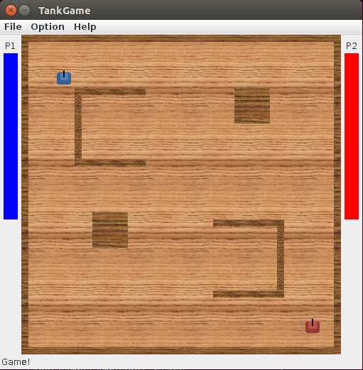

# Tank Game
Tank Game based off of "Wii Play Tanks" game, made for 2 people. Spring Break Project over my Senior year in High School when I was taking AP Computer Science & learning Java. 

## How To Run
Download Repo, then cd into bin, then run `java TankGamePlayer`. I never figured out how jar files work so you need to be cd'ed into the directory for the program to be able to find the media and image files.

## Rules
Move around the map, use power ups, health packs, and bullets to take down the opponent! Use walls to ricochet your bullets, along with portal guns for a surprise ambushes and attacks. Customize the game by disabling upgrades or healthpacks and create our own map!

## Controls
### Player 1:
Up: w  
Down: s  
Left: a  
Right: d  
Shoot: Space  
Turn Right: e  
Turn Left: q  
Portal Gun (Blue): 1  
Portal Gun (Orange): 3  

### Player 2 (Numpad):
Up: 5
Down: 2  
Left: 1  
Right: 3  
Shoot: 0  
Turn Right: 6   
Turn Left: 4  
Portal Gun (Blue): 7  
Portal Gun (Orange): 9

## Powerups/ Items:
**Speed Up**: Speeds up movement of your tank  
**Speed Down**: Slows down movement of your tank  
**Rapid Fire**: Increases your rate of fire  
**Slow Fire**: Decreases your rate of fire  
**Invisible**: Turns you invisible for a duration  
**Increase Max Fire**: Increases number of bullets you can shoot at once to 7  
**Decrease Max Fire**: Decreases number of bullets you can shoot at once to 3  
**Homing Rocket**: Turns your bullets into homing rockets that trace enemy  
**Plasma Gun**: Turns your bullets into high-damage large plasma balls that penetrate through walls  
**Shotgun**: Turns your bullets into shotgun that shoots 5 pellets at a time but doesn't ricochet  

## Custom Maps:
See BigCross.txt and FirstMap.txt as reference for how to make new maps, then add your custom map file title into MapFile.txt.

## AI Mode:
TBD

